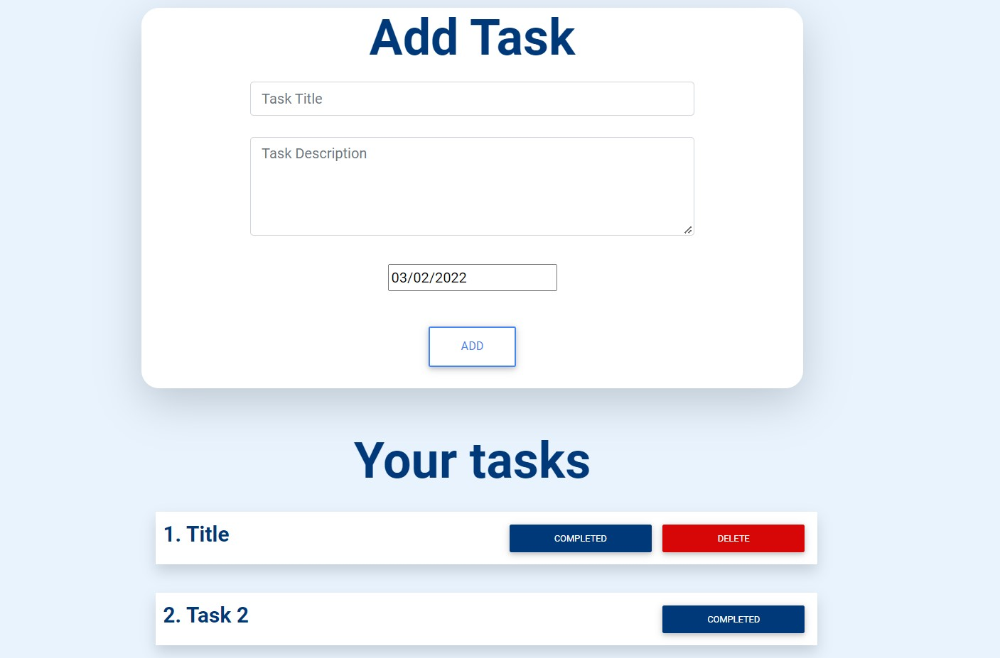

# CryptoNaukri Take Home Project

Given Site can be accessed at : https://cryptonaukrithp.netlify.app/
and is 100% responsive.

### Libraries used :

- Reactjs
- MDBootstrap
- react-datepicker

### Functionality of different buttons

- Add : To Add Task .
- Delete : Will remove that task .
- Completed : Will mark task as completed , thus removing the delete button.

#### Note :

The given task required asked me to use Material UI to design the web app but due to my mid-semester exams (time constrains) I was not able to do so , thus I used the library which I am familiar with i.e. MDBootstrap.Although I am willing to learn Material-UI if company's day to day work requires so.

### ScreenShot :

